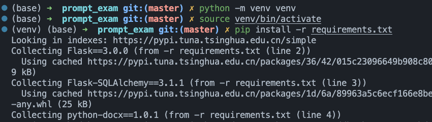
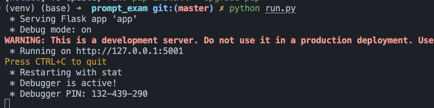
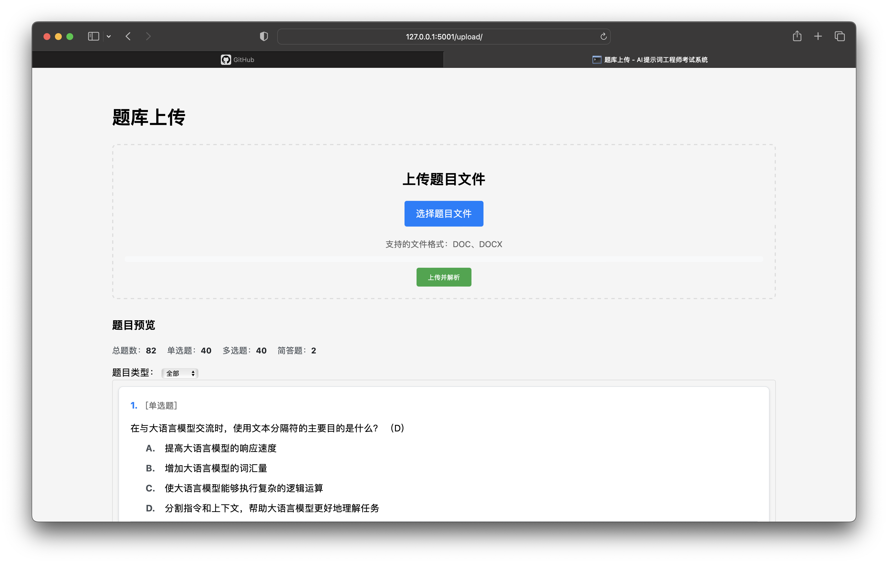
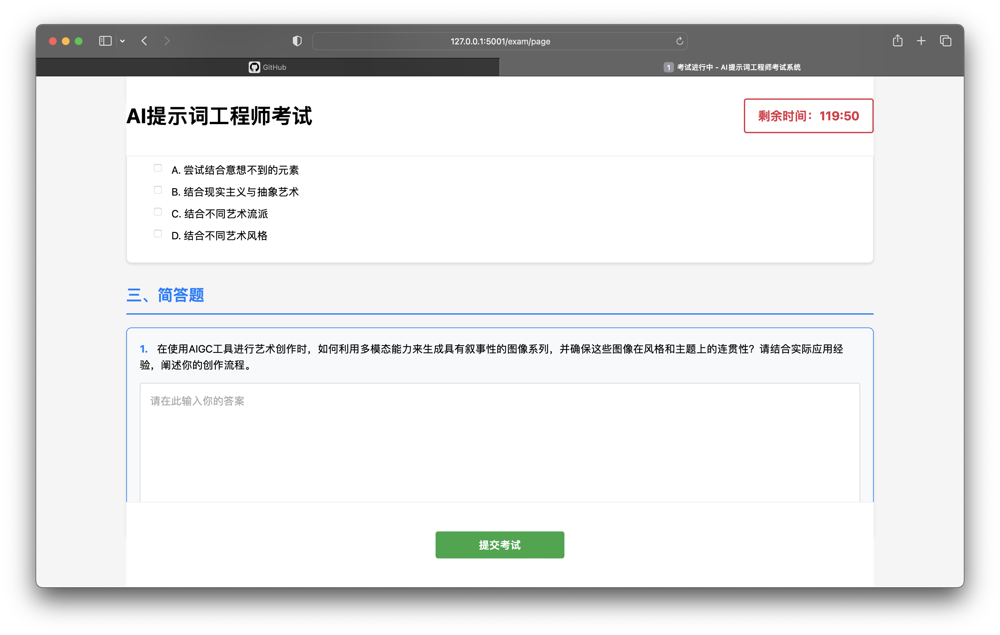
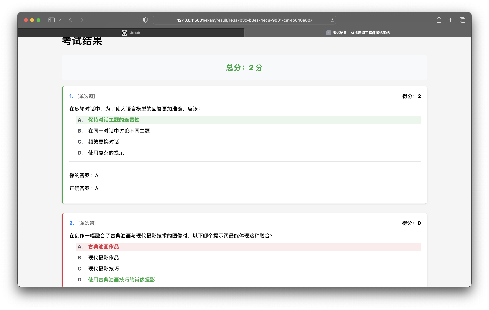

# 环境准备

## 创建python虚拟环境
```bash
python -m venv venv
```
## 激活虚拟环境
```bash
source venv/bin/activate
```
## 安装依赖
```bash
pip install -r requirements.txt
```
# 使用
## 启动服务
```bash
python run.py
```

## 访问服务
```bash
http://localhost:5001/
```

### 上传题库


### 生成试卷

### 开始考试

### 查看成绩

- 单选题每题 2分
- 多选题每题 4分
- 简答题每题 0分